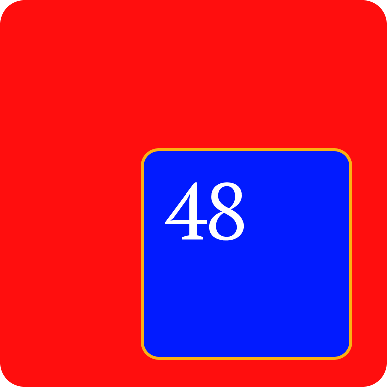

# Power-Law Chrome Extension

### Displays a law from "The 48 Laws of Power" on every new tab, with a customizable search bar, shortcuts grid, clock, and greeting.

## Features

- **Law of the Day:** Shows a different law each day.
- **Customizable Search:** Choose Google, Bing, DuckDuckGo, or Wikipedia.
- **Shortcuts Grid:** Add, edit, delete, and reorder your favorite sites.
- **Clock & Greeting:** Displays current time and greeting.
- **Options Page:** Toggle features and set your default search engine.

## Installation

1. Download or clone this repository.
2. Go to `chrome://extensions` in Chrome.
3. Enable "Developer mode".
4. Click "Load unpacked" and select the project folder.

## Usage

- Open a new tab to use the extension.
- Click the settings icon or go to the options page to customize.
- Add or edit shortcuts from the new tab page.

## File Structure

- `manifest.json` – Extension manifest.
- `new_tab.html` – New tab UI.
- `script.js` – New tab logic.
- `options.html` – Options/settings page.
- `options.js` – Options page logic.
- `icons/` – Extension icons.
